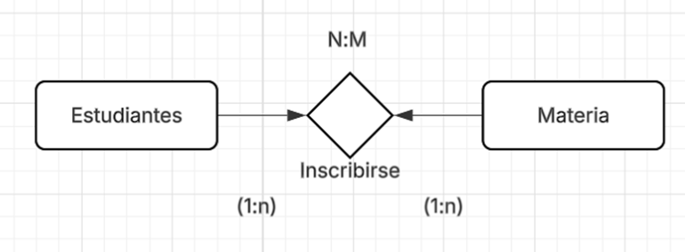
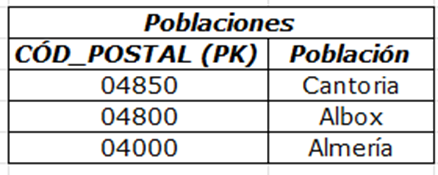

# BASE_DE-DATOS_II
Trabajos de Base de Datos II
# 📊 BASE DE DATOS II - TALLER #1

## 📋 Información General
- **Materia:** Base de Datos II
- **Trabajo:** Taller #1 - Desarrollo Completo
- **Estudiante:** Gil Ortiz (8-1011-2311)
- **Repositorio GitHub:** [https://github.com/Alberto0920/BASE_DE-DATOS_II](https://github.com/Alberto0920/BASE_DE-DATOS_II)

## 📚 Documentos
- 📄 [Documento Completo en PDF](TALLER#1_Gil_Ortiz.pdf)
- 📝 [Documento Original en Word](TALLER#1_Gil_Ortiz.docx)

---

# 📖 DESARROLLO DEL TALLER

## I PARTE -- CARDINALIDAD (20 puntos)

### 🔹 Problema #1: Identificación del tipo de cardinalidad

**Escenario:** Una universidad maneja la siguiente información:
- Un estudiante puede estar inscrito en varias materias.
- Una materia puede tener muchos estudiantes inscritos.

#### Preguntas:
1. **¿Qué tipo de relación existe entre Estudiante y Materia?**  
   Desde el punto de vista del modelado relacional, la relación entre Estudiante y Materia corresponde a una relación muchos a muchos (N:M).

2. **¿Cuál es la cardinalidad de esta relación?**  
   Un registro de Estudiante puede asociarse con múltiples registros de Materia, y cada registro de Materia puede relacionarse con varios registros de Estudiante.

3. **¿Por qué no es correcto modelar como 1:1 o 1:N?**
   - No se modela como 1:1 porque una entidad Estudiante puede vincularse con más de una Materia.
   - No se modela como 1:N porque una entidad Materia no depende de un único Estudiante.

4. **Diagrama de cardinalidad:**
   
   

---

### 🔹 Problema #2: Cardinalidad aplicada al modelo Entidad-Relación

**Escenario:**
- Un cliente puede realizar muchos pedidos.
- Cada pedido pertenece a un solo cliente.
- Un pedido no puede existir sin un cliente.

#### Preguntas:
1. **Indica la cardinalidad entre Cliente y Pedido**  
   Relación 1:N (Cliente -- Pedido).

2. **Especifica si la participación del Pedido es total u opcional**  
   Participación total, requiere clave foránea de Cliente.

3. **Representación de la cardinalidad:**
   
   

---

### 🔹 Tipos de Cardinalidad
- [x] **a. Relación 1-1**
- [ ] b. Relación 0-0
- [ ] c. Relación R-r
- [x] **d. Relación 1-N**
- [x] **e. Relación N-M**

---

## II PARTE -- NORMALIZACIÓN (30 puntos)

### 🔹 1. Primera Forma Normal (1FN)

**Tabla Original:**

**Condiciones para 1FN:**
- Atributos atómicos
- Sin campos multivaluados
- Existe una clave primaria

**Tabla Normalizada en 1FN:**

---

### 🔹 2. Segunda Forma Normal (2FN)

**Tabla Original:**

**Condiciones para 2FN:**
- Cumple la 1FN
- No existen dependencias parciales
- Los atributos no clave dependen de la clave completa

**Tablas Normalizadas en 2FN:**

---

### 🔹 3. Diferencia entre 1FN y 2FN
- **1FN:** Elimina atributos no atómicos
- **2FN:** Elimina dependencias parciales y reduce redundancia
- Verificar que no existan dependencias transitivas

---

### 🔹 4. Tercera Forma Normal (3FN)

**Tabla Original:**

**Condiciones para 3FN:**
- Cumple la 2FN
- No existen dependencias transitivas
- Los atributos no clave dependen únicamente de la clave primaria

**Tablas Normalizadas en 3FN:**

---

### 🔹 5. ¿Qué comprobar para pasar de 2FN a 3FN?
Se debe verificar que:
- No existan dependencias transitivas
- Ningún atributo no clave dependa de otro atributo no clave

---

## III PARTE -- DIAGRAMA ENTIDAD-RELACIÓN (50 puntos)

### 🔹 Parte A: Análisis de Escenarios

#### Escenario 1: Clientes y Cuentas Bancarias
**Entidades identificadas:**
1. **Cliente** (cédula, nombre, apellidos)
2. **Cuenta Bancaria** (código de cuenta, número de cuenta, saldo)

**Relación:** Un cliente puede tener muchas cuentas bancarias  
**Cardinalidad:** 1:N

---

#### Escenario 2: Empresa de Gestión de Inversiones
**Entidades encontradas:**
- **Acción** (entidad fuerte): nombre empresa, NIF, siglas, domicilio
- **Cotización** (entidad débil): fecha, hora, valor

---

### 🔹 Problema #3: Sistema de Gestión de Citas Médicas

**Escenario:** Una clínica privada desea implementar un sistema para administrar sus pacientes, médicos y citas.

**Detalles:**
- Un paciente puede tener muchas citas
- Un médico puede atender muchas citas
- Cada cita corresponde a un solo paciente y médico
- Una cita tiene: fecha, hora y motivo
- Un médico puede existir en el sistema, aunque aún no tenga citas asignadas

#### Solución:
1. **Entidades principales:** Paciente, Médico, Cita
2. **Relaciones:** Paciente -- Cita, Médico -- Cita
3. **Cardinalidad y participación:**
   - Paciente 1:N Cita (total)
   - Médico 1:N Cita (opcional)

**Diagramas:**

---

### 🔹 Problema #4: Sistema de Ventas de Tienda en Línea

**Escenario:** Una tienda en línea quiere controlar a sus clientes, productos y ventas.

**Detalles:**
- Un cliente puede realizar muchas ventas
- Cada venta pertenece a un solo cliente
- Una venta puede incluir varios productos
- Un producto puede aparecer en muchas ventas
- De cada producto vendido se debe registrar la cantidad y el precio de venta
- Un producto puede existir, aunque aún no se haya vendido

#### Solución:
1. **Entidades involucradas:** Cliente, Venta, Producto, Detalle_Venta
2. **Relaciones y cardinalidades:**
   - Cliente 1:N Venta
   - Venta N:M Producto
3. **Resolución de relación N:M:** Entidad intermedia Detalle_Venta
4. **Atributos dependientes de la relación:** cantidad, precio de venta

**Diagramas:**

---

## 📁 Estructura del Repositorio
