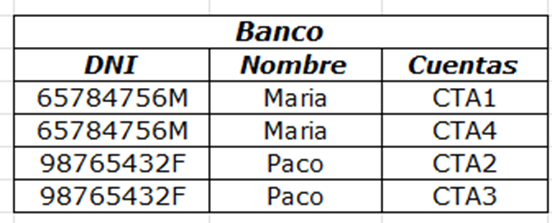
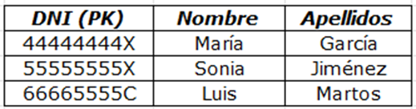
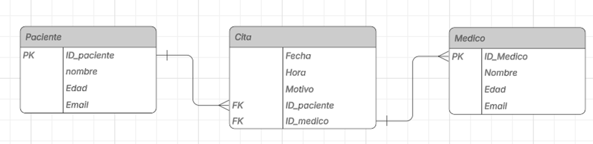

# BASE_DE-DATOS_II
Trabajos de Base de Datos II
# TALLER #1 - Base de Datos II
**Por: Gil Ortiz**

## 📚 Documentos
- 📄 [Documento completo en PDF](TALLER#1_Gil_Ortiz.pdf)

## 📊 Imágenes del Documento

### Parte I - Cardinalidad
1. **Relación Estudiante-Materia**
   

2. **Relación Cliente-Pedido**
   

### Parte II - Normalización
3. **Primera Forma Normal (1FN)**
   
   

4. **Segunda Forma Normal (2FN)**
   
   
   

5. **Tercera Forma Normal (3FN)**
   
   
   

### Parte III - Diagramas Entidad-Relación
6. **Sistema de Gestión de Citas Médicas**
   
   

7. **Sistema de Ventas Tienda en Línea**
   
   

---

## 📁 Estructura del Repositorio
